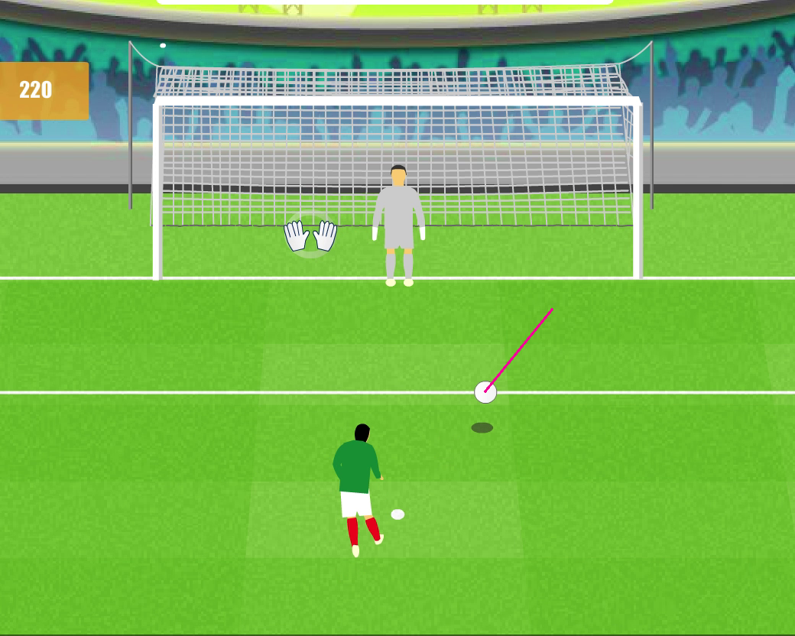
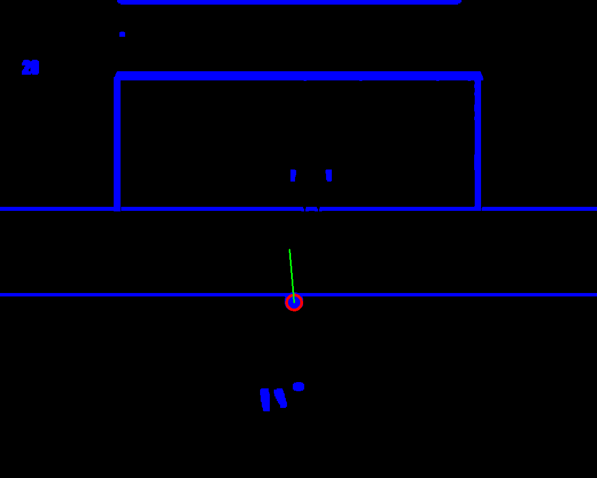

# Fundamentals of Computer Vision CSCE xxxx

## Offline Contributors
- **_Mohamed El Daw_**, classmate and groupmate.

## Demo

### Pipeline

1. We work frame-by-frame
1. Convert each frame to the HSV color space and threshold the frames (in effect, the whole video) to extract the whites in the video according to the following values:

$$
\begin{aligned}
    S &\le 25 \\
    V &\ge 240
\end{aligned}
$$

1. Preprocess each frame to make it easier to detect clean shapes in the thresholded image. The steps are:
    1. Blur the frame using a Gaussian 3x3 kernel with $\sigma_x = 10$.
    1. Erode the frame with a $J_{3}$ kernel.
    1. Dilate the frame with a $J_{3}$ kernel.

1. Apply Hough Circle detection to a subset of the frame (the area below the goal net proper) to find ball candidates. Parameters are:
    1. Using Canny Edge detection with paramters $5$ and $3$
    1. We detect balls with minimum distance between them of $200$ pixels
    1. Ball radii range in $[13, 20]$

1. Keeping a history of the position of the detected ball throughout the video, we calculate the difference between the current position and the immediately previous one in history, extending the vector ray forward to predict the next position
    1. We check for motion between the current frame $t$ position and position at $t-1$ by $L_1$ distance.

<i>The dark red line is the prediction oriented somewhere in the first 2 quadrants</i>

 

_
Screenshot of segmentation and detection in action
_
